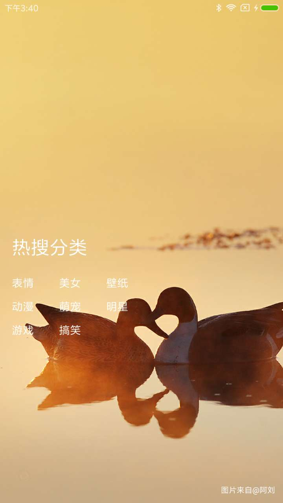

该项目react native 练手写的。各种问题，请见谅

接口抓取的时候百度图片接口，
仅做练手数据使用

瀑布流 请参考 autoresponsive

##todo
<> 下拉刷新，加载更多  
<> 搜索功能  
<> 图片下载  
<> ...

##截图

## 环境安装
React Native 安装过程，请参考[官方](https://github.com/react-community/create-react-native-app).